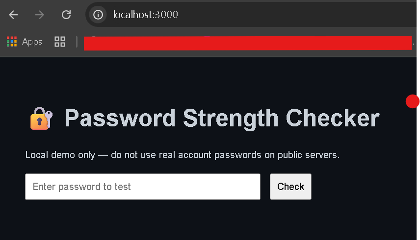
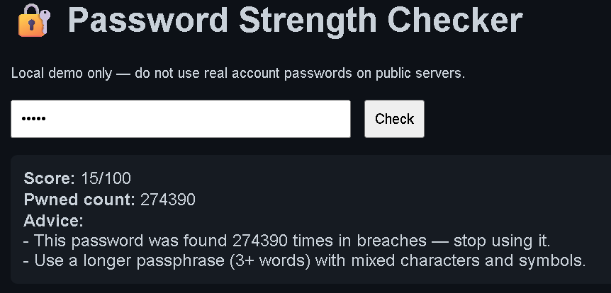

# 🔐 Password Strength Checker

A simple web app that checks the **strength of a password** and verifies whether it has been exposed in data breaches using the [Have I Been Pwned (HIBP) Pwned Passwords API](https://haveibeenpwned.com/API/v3#PwnedPasswords).

---

## 🚀 Features
- ✅ Password strength scoring (length, character variety, simple entropy heuristics)  
- ⚡ Breach checking using the **k-anonymity** model with SHA-1 (privacy-preserving)  
- 📊 Actionable feedback and advice  
- 🖥️ Local web UI — runs on `http://localhost:3000`

---

## 🛠️ Tech stack
- **Node.js** + **Express.js**  
- **node-fetch@2** for HTTP requests  
- Node built-in **crypto** for SHA-1 hashing  
- Simple HTML + vanilla JS frontend

---


## 📂 Project Structure
```
Password-Checker/
├─ server.js # Backend (API + HIBP integration)
├─ public/
│ └─ index.html # Frontend UI
├─ package.json
├─ package-lock.json
└─ README.md
```

---

## ⚙️ Setup & usage

### 1) Install dependencies
From the `Password-Checker` folder:
```bash
npm install
```

### 2) Start the server
```bash
node server.js
```

The server will start on:
```arduino
http://localhost:3000
```

Open your browser at:
```
http://localhost:3000
```

### 3) Test

Enter a test password in the UI. Example response:
```vbnet
Score: 35/100
Pwned count: 13452
Advice:
- This password was found 13452 times in breaches — stop using it.
- Use a longer passphrase (3+ words) with mixed characters and symbols.
```

---

## 🖼️ Screenshot

Here’s what the Password Checker UI looks like when running locally:
- Password Checker

- Result of weak password

---
## 🔒 Security & privacy notes (important)

- Do not use real account passwords when testing on public or shared servers. This project is for local, educational use.

- The HIBP API uses k-anonymity (only the first 5 hex chars of the SHA-1 hash are sent), so full passwords are never transmitted to HIBP. However, your server computes the SHA-1 locally — avoid deploying an open/public service that accepts arbitrary passwords unless you clearly warn users and secure the service.

- Never log or store submitted passwords. If you accidentally committed any logs or node_modules/, remove or ignore them (see .gitignore below).
  
---

## 🧰 .gitignore (recommended)

Create a .gitignore in this folder with:
```lua
node_modules/
npm-debug.log*
yarn-debug.log*
yarn-error.log*
dist/
.env
```

If node_modules/ was already committed, run:
```bash
git rm -r --cached node_modules
git commit -m "Remove node_modules from repo"
git push
```

## 📖 Lessons learned

- Built a simple password scoring algorithm and local web UI

- Integrated an external API securely using k-anonymity

- Practiced safe handling and privacy-aware design for security tooling

---

## 👨‍💻 Author: Mohammad Sohaib
📌 BSc (Hons) Networks and Cyber Security student


