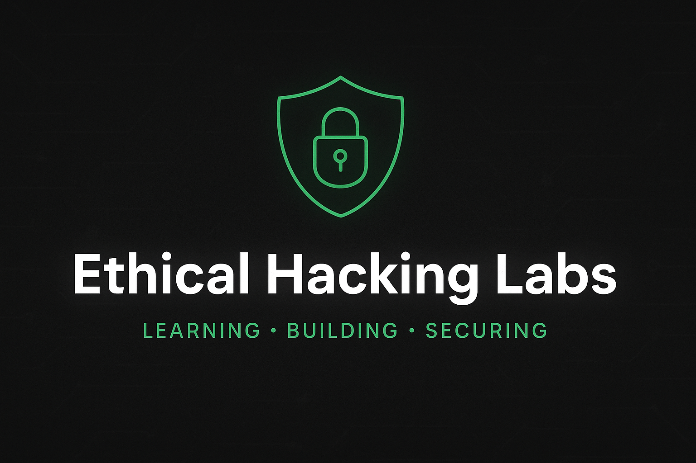

<p align="center">
  
</p>

# 🛡️ Ethical Hacking Labs

A collection of small security tools and projects for **ethical hacking practice**.  
Each project is documented in its own folder with setup instructions, source code, and lessons learned.  

---

## 📑 Table of Contents
- [Projects](#-projects)  
- [Purpose](#-purpose)  
- [Security & Disclaimer](#-security--disclaimer)  
- [Contributing](#-contributing)  
- [Contact & License](#-contact--license)

---

## 📂 Projects

- 🔍 [Python Port Scanner](PortScanner/README.md) — **✅ Ready**  
  *A fast, multithreaded port scanner written in Python. Run (quick):*  
  ```bash
  python portscanner.py
  ```
  (Also packaged as a Windows .exe in PortScanner/dist.)

- 🔐 [Password Strength Checker](Password-Checker/README.md) — **✅ Ready**
  *Node.js + HIBP k-anonymity web app. Quick run:*
  ```bash
  # inside Password-Checker
  npm install
  node server.js
  # then open http://localhost:3000  
  ```

- 📡 Packet Sniffer (coming soon) — 🧪 In progress
  Capture and analyse packets using Python + Scapy (lab-only).

- 🌐 Web Vulnerability Scanner (coming soon) — 🧪 Planned
  Automated checks for common web issues (headers, simple XSS checks) — testing in lab environments. 

---

## 🎯 Purpose
This repository is designed to:  
- Strengthen hands-on ethical hacking and networking skills.  
- Provide educational tools and lab exercises.  
- Serve as a portfolio of reproducible security projects. 

---

## ⚠️ Security & Disclaimer
- Read before using any tools in this repo.
- These tools are for educational and authorized testing only. Use them only on systems and networks you own or where you have explicit written permission.
- Unauthorized scanning, fingerprinting, or intrusion attempts can be illegal and unethical. The author is not responsible for misuse.
- Many tools here run locally. Do not expose the Password-Checker or similar services to public internet without clear user warnings and protections.
- Always follow local laws and institutional policies when testing. 

---

## 🤝 Contributing
Contributions, reports, and improvements are welcome. Please:
1. Fork the repo.
2. Create a topic branch.
3. Open a PR with a clear description and usage notes.

If you want to add a new lab, include:
- A short README describing purpose & how to run the tool safely.
- License & attribution for any third-party code.

 ---

## 📫 Contact & License
**Author:** Mohammad Sohaib — BSc (Hons) Networks and Cyber Security  
- Portfolio: https://M-Sohaib-cyber.github.io  
- GitHub: https://github.com/M-Sohaib-cyber  

📜 Licensed under the [MIT License](LICENSE).
